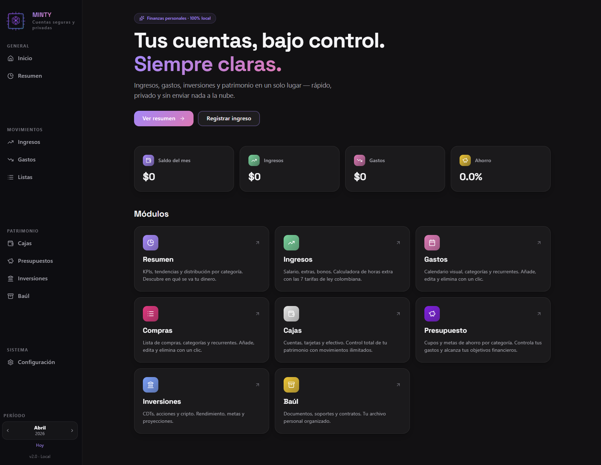
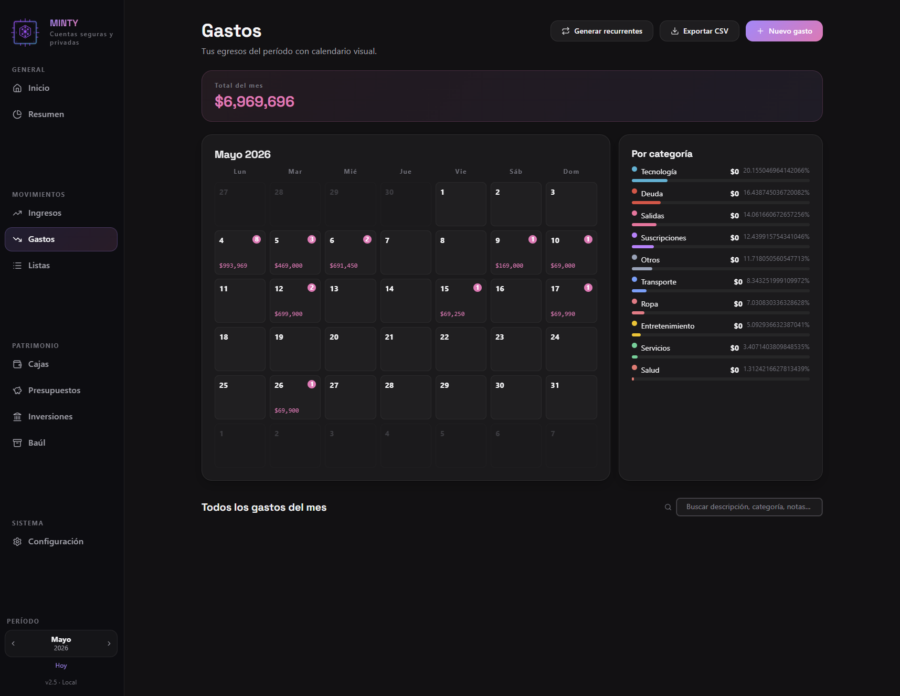

<div align="center">


# MINTY

**Gestor personal de finanzas, hecho con [Reflex](https://reflex.dev) puro Python.**
Controla gastos, ingresos, cajas, inversiones y compras recurrentes desde una sola app local — sin nube, sin telemetría, sin ataduras.

[](https://www.python.org/)
[](https://reflex.dev/)
[](https://sqlite.org/)
[](#-licencia)

[Funcionalidades](#-funcionalidades) • [Instalación](#-instalación) • [Estructura](#-estructura-del-proyecto) • [Arquitectura](ARQUITECTURA.md) • [Roadmap](#-roadmap)

</div>

---

## ✨ ¿Qué es esto?

**MINTY** es una app full-stack escrita 100 % en Python que te permite llevar tu contabilidad personal con la potencia de una hoja de cálculo y la comodidad de una interfaz moderna.

A diferencia de un Excel, tiene **estado reactivo**, formularios, validación, reportes por periodo y soporte para compras a cuotas, recurrencias avanzadas y conversiones de divisas en vivo. Todo corriendo en tu máquina, con SQLite y sin enviar ni un byte a la nube.

> 💡 **Ideal para:** quien quiera control fino de sus finanzas, programadores curiosos por aprender Reflex, o cualquiera que prefiera privacidad sobre comodidad de un SaaS.

---

## 🚀 Funcionalidades

### 📊 Módulos principales

| Módulo | Descripción |
|---|---|
| 🏠 **Inicio** | Dashboard con totales del periodo activo y accesos rápidos. |
| 📈 **Resumen** | Análisis del periodo: ingresos vs. gastos, saldos por caja, top categorías. |
| 💸 **Gastos** | Registro detallado, categorías, compras a cuotas, **recurrencias avanzadas** (días/semanas/meses/años con intervalo). |
| 💰 **Ingresos** | Salarios, freelance, devoluciones — con soporte multi-moneda y recurrencia. |
| 🏦 **Cajas** | Múltiples cuentas (efectivo, banco, ahorros, **tarjetas de crédito**) con saldos calculados en tiempo real. |
| 💳 **Tarjetas de crédito** | Cupo, deuda, disponible, intereses (compras/avances, mes/EA), cuota de manejo automática, día de corte (1 ó 2), día de pago, TRM propio del banco para gastos en USD, modal de **Pago de tarjeta** y **Cargar deuda directa** sin afectar tu efectivo real. |
| 🛒 **Compras** | Lista de mercado / wishlist con grupos, ítems recurrentes y conversión a gasto en un click. |
| 📦 **Baúl** | Inventario de bienes durables con depreciación opcional. |
| 📉 **Inversiones** | Seguimiento de portafolio, P&L, rendimiento por activo. |

### 🛠️ Características técnicas

- ⚡ **Reactividad total** — la UI se actualiza sola cuando el state cambia (sin `setState` ni Redux).
- 📊 **Patrimonio real** — métrica en Resumen que mide cuánto creció (o bajó) tu plata real entre el inicio y el cierre del periodo, excluyendo cajas TC. **% Ahorro** se calcula como `(Patrimonio + categoría "Ahorro") / Ingresos`.
- 🔁 **Recurrencias inteligentes** — define un gasto cada 2 meses, cada 15 días o cada año; la app genera las ocurrencias automáticamente y de forma idempotente. También genera **cuotas de manejo** de TC del periodo cuando ya pasó la fecha de cobro.
- 💳 **Compras a cuotas** — registra una compra a 12 cuotas y se reparten correctamente entre los periodos.
- 🌍 **Conversión de divisas en vivo** — TRM oficial (datos.gov.co) + Frankfurter para EUR/GBP/etc.
- 🎨 **Tema claro/oscuro** con animación de transición de vista (View Transitions API).
- 🔐 **100 % local** — tus datos nunca salen de tu máquina (`data/cuentas.db`).
- 🔄 **Backups manuales** integrados (export ZIP de la base de datos).
- ✅ **Tests** con `pytest` (19/19 verdes).

---

## 🖼️ Capturas




---

## 🧰 Stack

- **[Reflex](https://reflex.dev)** 0.9+ — frontend (React generado) + backend (FastAPI) en un solo Python.
- **[SQLModel](https://sqlmodel.tiangolo.com/)** sobre SQLite — modelos tipados, migraciones ligeras propias.
- **[Tailwind v4](https://tailwindcss.com)** vía plugin oficial de Reflex.
- **[Lucide Icons](https://lucide.dev)** — iconos consistentes en toda la app.
- **[Pandas](https://pandas.pydata.org/)** — para reportes y agregaciones.
- **[Requests](https://docs.python-requests.org/)** — fetch de TRM y tasas de cambio.

---

## ⚙️ Instalación

### Requisitos

- **Python 3.14+** (probado en 3.14.0)
- **Node.js 18+** (Reflex lo usa para el frontend; lo instala solo la primera vez)
- Windows / macOS / Linux

### Pasos

```bash
# 1. Clonar el repositorio
git clone https://github.com/Turumack/APP-Gestor-de-gastos-.git
cd APP-Gestor-de-gastos-

# 2. Crear y activar entorno virtual
python -m venv .venv
# Windows (PowerShell):
.venv\Scripts\Activate.ps1
# macOS / Linux:
source .venv/bin/activate

# 3. Instalar dependencias
pip install -r requirements.txt

# 4. (Opcional) Configurar variables de entorno
cp .env.example .env
# edita .env si quieres usar Supabase, etc.

# 5. Inicializar Reflex (solo la primera vez)
reflex init

# 6. ¡Lanzar la app!
reflex run
```

La app abre en:
- **Frontend:** http://localhost:3000
- **Backend:** http://localhost:8000

> 💡 La base de datos SQLite se crea automáticamente en `data/minty.db` la primera vez que la lanzas. Está en `.gitignore`, así que es 100 % tuya.

---

## 📁 Estructura del proyecto

```
APP Gestor de Gastos/
├── 📄 rxconfig.py              # Configuración de Reflex (puertos, BD, plugins)
├── 📄 requirements.txt         # Dependencias Python
├── 📁 assets/                  # Logos, iconos, fuentes
├── 📁 data/                    # SQLite local (gitignored)
└── 📁 minty/                  # App principal
    ├── app.py                  # Entry point + montaje de páginas
    ├── models.py               # SQLModel (Gasto, Ingreso, Caja, ...)
    ├── db.py                   # Conexión + migraciones ligeras
    ├── theme.py                # Paleta de colores y tokens
    ├── 📁 components/          # UI reutilizable (sidebar, inputs, layout, ...)
    ├── 📁 pages/               # Una página = un .py (home, gastos, ingresos, ...)
    ├── 📁 state/               # Estado reactivo por dominio
    └── 📁 services/            # Integraciones externas (TRM, scraping)
```

---

## 🧪 Tests

```bash
pytest -v
```

Los tests cubren cálculos de saldos, generación de recurrencias y reparto de cuotas.

---

## ☁️ Despliegue (Railway)

La app está lista para correr 24/7 en [Railway](https://railway.app) con Postgres y login propio.

**Setup rápido:**

1. *New Project* → *Deploy from GitHub repo* → este repo.
2. *Add Plugin* → **PostgreSQL** (inyecta `DATABASE_URL` automáticamente).
3. *Variables*: define `MINTY_HOST=tu-dominio.up.railway.app`. **No** se guardan credenciales en variables de entorno.
4. *Networking* → *Generate Domain*.
5. (Una vez) Migra tu BD local: `$env:PG_URL="postgres://..."; python tools/migrar_sqlite_a_postgres.py`.
6. (Una vez) Crea tu usuario: `railway run python tools/set_password.py` (la contraseña se hashea con **bcrypt** y vive solo en la BD privada).
7. En el celular: abre la URL en Chrome → menú → *Añadir a pantalla de inicio* (PWA).

Detalles completos en [ARQUITECTURA.md](ARQUITECTURA.md#105-despliegue-en-railway-postgres--auth).

---

## 🛣️ Roadmap

- [x] Recurrencia avanzada (días / semanas / meses / años)
- [x] Editar grupos e ítems de compra
- [x] Compras únicas vs. recurrentes
- [x] Eliminar compra completa (todas sus cuotas)
- [x] Tarjetas de crédito completas (cupo, deuda, intereses, cuota de manejo, TRM propio, pagos)
- [x] Patrimonio real + % Ahorro basado en patrimonio + categoría "Ahorro"
- [ ] Importar extractos bancarios (CSV / OFX)
- [ ] Gráficos interactivos en el resumen
- [ ] App móvil (Reflex Native cuando esté maduro)
- [ ] Exportar reportes a PDF
- [ ] Soporte multi-usuario opcional con Supabase

---

## 🤝 Contribuir

Pull requests bienvenidos. Para cambios grandes, abre primero un issue para discutir qué te gustaría añadir.

```bash
# Flujo recomendado
git checkout -b feat/mi-feature
# ... haz cambios ...
pytest -v          # asegúrate de que todo pasa
git commit -m "feat: descripción corta"
git push origin feat/mi-feature
# abre el PR en GitHub
```

---

## 🔒 Privacidad y datos

- Esta app **no envía datos a ningún servidor externo** por defecto.
- La telemetría de Reflex está **desactivada** (`telemetry_enabled=False` en `rxconfig.py`).
- Tu base de datos vive solo en `data/minty.db` (gitignored).
- Si configuras Supabase en `.env`, **ese archivo está gitignored**.

---

## 📜 Licencia

Distribuido bajo licencia **[PolyForm Noncommercial 1.0.0](https://polyformproject.org/licenses/noncommercial/1.0.0)**. Ver [LICENSE](LICENSE) para el texto completo.

**En resumen:**
- ✅ Puedes **usarla, modificarla y compartirla libremente** para fines personales, educativos, de investigación o sin fines de lucro.
- ✅ Puedes contribuir, hacer forks y crear trabajos derivados.
- ❌ **No puedes** usarla con fines comerciales (vender, ofrecer como SaaS de pago, integrarla en un producto/servicio comercial) sin permiso expreso.

Para licencias comerciales, contacta al autor.

---

## 💬 Autor

Hecho con ❤️ por [**@Turumack**](https://github.com/Turumack)

> *Si esta app te resulta útil, ⭐ una estrella en GitHub me hace el día.*

